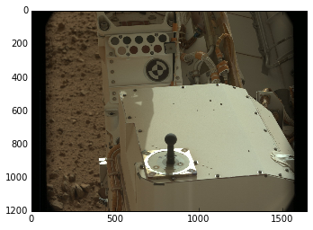
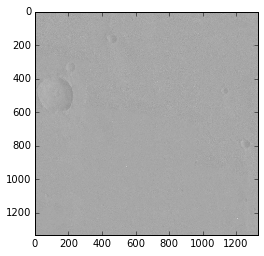
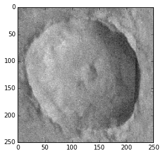
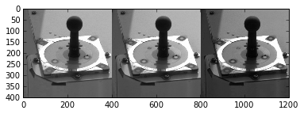
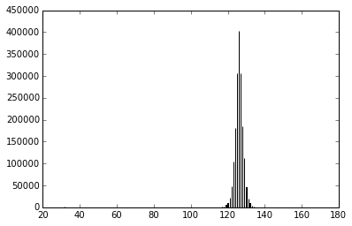
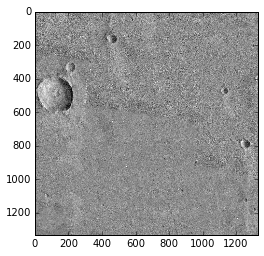

========
Usage
========

Quick Explanation
------------------

The example below shows how to use ``planetaryimage``'s ``PDS3Image`` class to
open a PDS image, inspect it's label and display the image data::

 >>> from planetaryimage import PDS3Image
 >>> import matplotlib.pyplot as plt
 >>> testfile = 'tests/mission_data/2p129641989eth0361p2600r8m1.img'
 >>> image = PDS3Image.open(testfile)
 >>> print(image.record_bytes)               # access attribute
 128
 >>> print(image.label['FILE_RECORDS'])      # access label
 332
 >>> plt.imshow(image.image, cmap='gray')  # display image

Examples
---------

Setup::

 >>> %matplotlib inline
 >>> from glob import glob
 >>> import numpy as np
 >>> import matplotlib.pyplot as plt
 >>> import matplotlib.image as mpimg
 >>> from planetaryimage import PDS3Image, CubeFile

Gather the Images::

 >>> pdsfiles = glob("*.*")
 >>> images = []
 >>> for pdsfile in pdsfiles:
 ...    try:
 ...        images.append(PDS3Image.open(pdsfile))
 ...    except:
 ...        pass
 >>> for n, image in enumerate(images):
 ...    print n, image
 0 1p190678905erp64kcp2600l8c1.img
 1 mk19s259.img
 2 m0002320.imq
 3 mg00n217.sgr
 4 h2225_0000_dt4.img
 5 0044ML0205000000E1_DXXX.img

One can use the ``try`` statement in-case any of the images you have are
not compatible with PDS3image. See `Suppored Planetary Images List <https://
planetaryimage.readthedocs.org/en/latest/supported_planetary_image_types.html>`_
to know what image types are compatible. The ``for loop`` will show what index
number to use in future use of the image.

To see the information about each image::

 >>> for i in images:
 ...    print i.data.dtype, i.data.shape, i.shape
 >i2 (1, 1024, 32) (1, 1024, 32)
 uint8 (1, 1331, 1328) (1, 1331, 1328)
 uint8 (1, 1600, 384) (1, 1600, 384)
 uint8 (1, 960, 964) (1, 960, 964)
 >i2 (1, 10200, 1658) (1, 10200, 1658)
 uint8 (3, 1200, 1648) (3, 1200, 1648)

To display a three band, color, image::

 >>> caltarget = images[5]
 >>> plt.imshow(caltarget.image)
 <matplotlib.image.AxesImage at 0x10a13c250>

It is important to look at the first number in ``i.shape`` (See attributes) or
the value from ``i.bands``. If this number is 3, then the above example works,
otherwise, you should use ``cmap=='gray'`` parameter like in the below example.

To display a single band, grayscale, image::

 >>> image1 = images[1]
 >>> plt.imshow(image1.image, cmap='gray')
 <matplotlib.image.AxesImage at 0x125817a50>

The ``cmap`` keyword argument defines which ``colormap`` a grayscale image
should be displayed with. In the case where ``i.bands`` is 3, it means the
image is an RGB color image which does not need a colormap to be displayed
properly.  If ``i.bands`` is 1, then the image is grayscale and ``imshow``
would use its default colormap, which is not grayscale.

To see a subframe of an image::

 >>> plt.imshow(image1.image[370:620, 0:250], cmap = 'gray')
 <matplotlib.image.AxesImage at 0x11c014450>

To see the different bands of a colored image::

 >>> plt.imshow(np.hstack([
        mcam1.image[700:1100, 600:1000, 0],
        mcam1.image[700:1100, 600:1000, 1],
        mcam1.image[700:1100, 600:1000, 2],
    ]), cmap='gray')
 <matplotlib.image.AxesImage at 0x10fccd210>

To save an image as a `.png` file for later viewing::

 >>> crater = image1.image[370:620, 0:250]
 >>> plt.imsave('crater.png', crater, cmap='gray')

To do some image processing::

 >>> plt.hist(image1.image.flatten(), 2000)
 (array([ 2.,  0.,  0., ...,  0.,  0.,  1.]),
 array([  32.   ,   32.036,   32.072, ...,  175.928,  175.964,  176.   ]),
 <a list of 4000 Patch objects>)

Using this Histogram can produce a clearer picture::

 >>> plt.imshow(image1.image, cmap='gray', vmin=115, vmax=135)
 <matplotlib.image.AxesImage at 0x1397a2790>

See `documentation for plt.imshow <http://matplotlib.org/api/pyplot_api.html#mat
plotlib.pyplot.imshow>`_ and `Image tutorial for pyplot <http://matplotlib.org/
users/image_tutorial.html>`_ to see more methods of image processing.

You can also use planetaryimage to process Isis Cube Files::

 >>> from planetaryimage import CubeFile
 >>> isisimage = CubeFile.open("tests/data/pattern.cub")
 >>> isisimage.data.dtype, isisimage.data.shape, isisimage.shape
 (dtype('<f4'), (90, 90), (1, 90, 90))
 >>> plt.imshow(isisimage.image, cmap='gray')
 <matplotlib.image.AxesImage at 0x114010610>

.. image:: Image_examples/Isisimage.png
